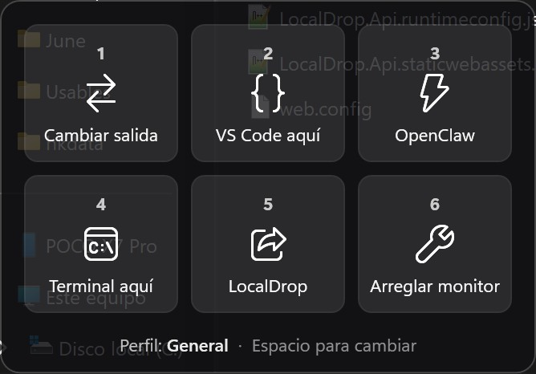

# Atajos

A Windows overlay that shows what each of your shortcuts does, so you never have to remember them. Hold `Ctrl+Shift`, the panel appears; press a number (or click a tile) to run that action. Multiple profiles, no hooks, no admin rights.



> The UI labels come from `perfiles.json` and are in Spanish, as is the user manual ([MANUAL.md](MANUAL.md)). The code, scripts and this document are in English.

## The problem

I had six macro keys, and the list kept growing. Each did something different and there was no way to remember them. Without a visual reference, keys stop being used — which is exactly what happened to half of them.

## How it works

| Input | Effect |
|-------|--------|
| **Hold `Ctrl+Shift`** | Opens the panel at the bottom-left of the screen. It closes when you let go. |
| `1` … `6` (while holding) | Runs that tile's action |
| `Space` (while holding) | Cycles to the next profile. Not registered at all when there is only one profile. |
| **Click a tile** | Runs that action. The panel stays open while the pointer is over it. |
| `Ctrl+Alt+Q` | Exit. Also available from the tray icon. |

The panel is the whole interface. It needs no special keys, so it works the same on a keyboard with macro keys as on a laptop.

## Design decisions

### Polling instead of a keyboard hook

`RegisterHotKey` cannot express a modifiers-only shortcut. The usual alternative is a `WH_KEYBOARD_LL` hook, which puts the process in the path of every keystroke on the machine — something game anti-cheat is right to be suspicious of.

Instead, the state of Ctrl and Shift is read with `GetAsyncKeyState` every 50 ms. No hook is installed, nothing is intercepted, and no keystroke ever passes through this code.

### The 350 ms delay is what keeps it out of the way

The `1`–`6` and `Space` shortcuts **exist only while the panel is on screen**, and the panel does not open until `Ctrl+Shift` has been held for 350 ms.

`Ctrl+Shift+1` in Excel (number format) or `Ctrl+Shift+Space` in VS Code (parameter hints) are released long before that threshold, so they never reach the overlay. Opening the panel has to be an intention, not an accident. The trade-off: hold `Ctrl+Shift` past 350 ms *and then* press `1` in Excel, and the overlay wins.

### Clickable without stealing focus

The first design used `WS_EX_TRANSPARENT` so clicks would pass through. That made sense for an always-visible panel; this one only appears while you use it, so the constraint was dropped. Two things make clicks safe:

- **`WS_EX_NOACTIVATE` is a requirement, not a nicety.** Without it, clicking a tile would make the overlay the foreground window, and an action like "open a terminal in the current folder" would resolve against the overlay instead of File Explorer.
- **Hovering keeps the panel open**, otherwise it would vanish on the way to the tile. The latch only arms after the pointer has left the panel once, so a panel that opens under a still cursor does not get stuck on screen.

### An action can never synthesize keystrokes

An action always runs while `Ctrl+Shift` are physically held — that is what keeps the panel open. Any key combination it injects arrives with those modifiers on top. The first version of the audio action sent `Win+Ctrl+V`; from a console it worked, from the panel Windows received `Win+Ctrl+Shift+V`, which is nothing. If an action needs a system effect, it calls the API that produces it (Core Audio, UI Automation), never imitates a user.

### Configuration and state never share a file

`perfiles.json` is written by hand; the active profile is written by the app on every cycle. If they lived together, the overlay would rewrite the file you maintain and destroy its formatting. So the active profile lives in `perfil-activo.txt`, written through a temp file plus `Move` so nothing ever reads a half-written name.

### Scripts are written in English, in plain ASCII

Windows PowerShell 5.1 reads a `.ps1` without a BOM using the ANSI code page, and any accented character is silently corrupted — no error, just broken text that surfaces weeks later in a log. Writing the scripts in English removes that class of bug instead of merely managing it. The BOM stays as a safety net.

## Architecture

```
hold Ctrl+Shift  ->  panel  ->  key 4
                                  |
                     Atajos.exe (perfiles.json + perfil-activo.txt)
                                  |
                     hidden powershell -> actions\_lib\run-action.ps1 -> actions\open-terminal-here.ps1
                                  |
                     on failure: stderr (UTF-8) -> atajos.log
```

The app is the only owner of "shortcut → action": no AutoHotkey, no vendor software, no intermediate process. One hidden `powershell.exe` per action. The `run-action.ps1` wrapper turns any thrown error into one readable line on stderr, so individual scripts never have to handle their own logging.

| File | Role |
|------|------|
| `MainWindow.xaml(.cs)` | The panel: polling, hotkey registration, DPI-aware positioning |
| `Profiles.cs` | Loads and validates `perfiles.json`, reloaded every time the panel opens |
| `ActionRunner.cs` | Launches actions and captures their errors |
| `KeyStatus.cs`, `AudioOutput.cs` | Live status line under a tile (e.g. which audio output the tile will switch to) |
| `TrayIcon.cs` | Tray icon: the only visible proof the app is alive |
| `Log.cs`, `AppPaths.cs` | Error log with rotation; every path resolved from `AppContext.BaseDirectory` |
| `actions/` | One PowerShell script per action, named after what it does, never after the key that calls it |

### perfiles.json

```json
{
  "perfiles": [
    {
      "id": "general",
      "nombre": "General",
      "teclas": {
        "G1": { "nombre": "Cambiar salida", "icono": "E8AB", "accion": "toggle-audio-output.ps1",
                "opciones": ["Realtek", "HyperX"], "estado": "salida-audio" },
        "G4": { "nombre": "Terminal aquí", "icono": "E756", "accion": "open-terminal-here.ps1" }
      }
    }
  ]
}
```

- `G1`–`G6` map to tiles `1`–`6`.
- `icono` is the hex code of a Segoe Fluent Icons glyph. Changing an icon means editing four characters.
- `accion` is a file name inside `actions\`. Leave it empty and the tile renders as free.
- `opciones` are passed to the script as arguments; `estado` names the provider for the live status line.

## Failure behavior

Actions run without a window, so an unlogged failure would be an invisible one.

| Situation | What happens |
|-----------|--------------|
| `perfiles.json` broken or missing | The panel shows the path and the parse error instead of an empty grid. It recovers on the next open. |
| Unknown active profile | Falls back to the first profile. |
| Action script missing or throws | Logged to `atajos.log` in one readable line. |
| A shortcut already taken by another app | Logged with its error code — otherwise it would be indistinguishable from a broken action. |
| Exception on the UI thread | Logged and swallowed, with a tray balloon. A background utility that silently disappears is worse than one that misses a key. |
| Second instance | Exits silently (single-instance mutex), which is what the startup shortcut needs. |

`atajos.log` rotates at 256 KB.

## Included actions

These are the ones I use daily. Several depend on tools on my machine, so treat them as examples of what an action can be.

| Action | What it does |
|--------|--------------|
| `toggle-audio-output.ps1` | Switches the default audio output between two devices via Core Audio (`IMMDeviceEnumerator` + `IPolicyConfig`), across all three roles |
| `open-vscode-here.ps1` / `open-terminal-here.ps1` | Opens VS Code / a terminal in the File Explorer folder you are looking at, falling back to the Desktop |
| `fix-display.ps1` | Recovers a monitor after sleep |
| `open-daily-note.ps1` | Opens today's note in an Obsidian vault |
| `show-recorda.ps1`, `start-localdrop.ps1`, `start-openclaw-gateway.ps1` | Launch personal tools; they fail with a logged message if the tool is not installed |

Adding one: drop a `.ps1` into `actions\` and reference it from `perfiles.json`. See [MANUAL.md](MANUAL.md).

## Known limitations

| Topic | Note |
|-------|------|
| Exclusive fullscreen games | No overlay can draw there. Borderless windowed works. |
| Elevated windows | `RegisterHotKey` does not receive keys while an elevated window has focus and the overlay is not elevated. |
| Synthetic input under anti-cheat | With some game clients in the foreground, injected input stops triggering global hotkeys, so automated tests of the tiles are meaningless while they run. Physical keys work. |
| Mixed-DPI setups | Positioned with `SetWindowPos` in physical pixels, twice, because moving to a monitor with another scale triggers a re-layout. |

## Build and install

Requirements: Windows 10/11, [.NET 10 SDK](https://dotnet.microsoft.com/download).

```powershell
dotnet build
.\bin\Debug\net10.0-windows\Atajos.exe
```

To install for daily use:

```powershell
.\deploy.ps1                 # publish, install to %LOCALAPPDATA%\Atajos, add to startup, launch
.\deploy.ps1 -SelfContained  # bundle the .NET runtime for a machine without it
```

`-NoStart` and `-NoAutostart` skip launching and the startup shortcut. The installed copy lives apart from the build folder on purpose: a running `.exe` is locked, so every `dotnet build` would fail, and a `dotnet clean` would delete the app in use. Deploying **never overwrites** an edited `perfiles.json`, the active profile or the logs.

## Stack

WPF on .NET 10, C#, plus PowerShell for the actions. WPF gives borderless, truly transparent, topmost windows and per-monitor DPI out of the box; `user32` P/Invoke covers the hotkeys with no dependencies. Ruled out: Electron (100 MB to draw six squares), WinForms (weaker transparency and DPI), AutoHotkey (macro keys from vendor drivers are not standard scancodes, so it could only sit *behind* the vendor software, never replace it).

## License

[MIT](LICENSE)
